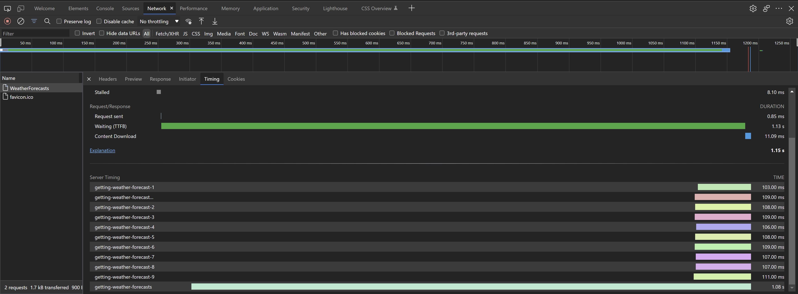

# Advanced

## Timing Blocks of Code

[`ServerTimingUtility`](../api/Lib.AspNetCore.ServerTiming.ServerTimingUtility.html) provides `TimeAction` method which allows for timing block of code. Calling the method starts a timer which will be stopped upon disposing the returned value.

```cs
[Route("api/[controller]")]
[ApiController]
public class WeatherForecastsController : Controller
{
    private readonly IServerTiming _serverTiming;

    public WeatherForecastsController(IServerTiming serverTiming)
    {
        _serverTiming = serverTiming;
    }

    [HttpGet]
    public async Task<IEnumerable<WeatherForecast>> Get()
    {
        List<WeatherForecast> weatherForecasts = new();

        IDisposable serverTimerInstance = _serverTiming.TimeAction();

        for (int daysFromToday = 1; daysFromToday <= 10; daysFromToday++)
        {
            weatherForecasts.Add(await GetWeatherForecastAsync(daysFromToday));
        };

        serverTimerInstance.Dispose();

        return weatherForecasts;
    }

    ...
}
```

This also allows for wrapping code block in `using` statement.

```cs
[Route("api/[controller]")]
[ApiController]
public class WeatherForecastsController : Controller
{
    ...

    [HttpGet]
    public async Task<IEnumerable<WeatherForecast>> Get()
    {
        List<WeatherForecast> weatherForecasts = new();

        using (_serverTiming.TimeAction())
        {
            for (int daysFromToday = 1; daysFromToday <= 10; daysFromToday++)
            {
                weatherForecasts.Add(await GetWeatherForecastAsync(daysFromToday));
            };
        }

        return weatherForecasts;
    }

    ...
}
```

Above snippets doesn't provide name for the metric as it is an optional parameter. If not provided, the method will generate a metric name based on caller attributes.

<center></center>

It's possible to nest timed code blocks, in such case it's strongly advised to provide names for metrics.

```cs
[Route("api/[controller]")]
[ApiController]
public class WeatherForecastsController : Controller
{
    ...

    [HttpGet]
    public async Task<IEnumerable<WeatherForecast>> Get()
    {
        List<WeatherForecast> weatherForecasts = new();

        using (_serverTiming.TimeAction("getting-weather-forecasts"))
        {
            for (int daysFromToday = 1; daysFromToday <= 10; daysFromToday++)
            {
                using (_serverTiming.TimeAction($"getting-weather-forecast-{daysFromToday}"))
                {
                    weatherForecasts.Add(await GetWeatherForecastAsync(daysFromToday));
                }
            };
        }

        return weatherForecasts;
    }

    ...
}
```

Unfortunatelly, the Server Timing API doesn't have a concept of nested metrics and there is no convention for nested rendering in browsers.

<center></center>

## Timing Tasks

[`ServerTimingUtility`](../api/Lib.AspNetCore.ServerTiming.ServerTimingUtility.html) also provides `TimeTask` method which allows for timing a `Task`.

```cs
[Route("api/[controller]")]
[ApiController]
public class WeatherForecastsController : Controller
{
    ...

    [HttpGet]
    public async Task<IEnumerable<WeatherForecast>> Get()
    {
        List<WeatherForecast> weatherForecasts = new();

        using (_serverTiming.TimeAction("getting-weather-forecasts"))
        {
            for (int daysFromToday = 1; daysFromToday <= 10; daysFromToday++)
            {
                weatherForecasts.Add(await _serverTiming.TimeTask(GetWeatherForecastAsync(daysFromToday), $"getting-weather-forecast-{daysFromToday}"));
            };
        }

        return weatherForecasts;
    }

    ...
}
```

The result of the above snippet is exactly the same as the previous one.

## Timing Based on Environment or Settings

An option to enable/disable timing based on environment or some settings is to create a condition around `IServerTiming` registration.

```cs
public class Startup
{
    public void ConfigureServices(IServiceCollection services, IWebHostEnvironment env)
    {
        ...

        if (env.IsDevelopment())
        {
		    services.AddServerTiming();
        }

		...
    }

    public void Configure(IApplicationBuilder app, IWebHostEnvironment env)
    {
        ...
			
        if (env.IsDevelopment())
        {
		    app.UseServerTiming();
		}
        
		...
    }
}
```

When doing this, the service needs to be inject in a way which allows for null and the ternary conditional operator (`?.`) can be used to call methods against a service instance in a `null` safe way.

```cs
serverTiming?.Metrics.Add(new ServerTimingMetric("cache", 300, "Cache"));
```

Additonally the `TimeAction` and `TimeTask` methods are safe to be called against `null`.