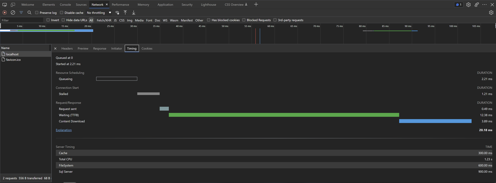

# Getting Started

## Configuration

In order to add the Server Timing API support to an application a required service and middleware must be registered. The library provides [extensions](../api/Microsoft.AspNetCore.Builder.html) which make it really simple.

```cs
public class Startup
{
    public void ConfigureServices(IServiceCollection services)
    {
        ...

		services.AddServerTiming();

		...
    }

    public void Configure(IApplicationBuilder app)
    {
        ...
			
		app.UseServerTiming();
			
		...
    }
}
```

Options can be set when registering the middleware - e.g. to set URLs that are allowed to see values from timing APIs (which would otherwise be reported as zero due to cross-origin restrictions), or to only send timings in a development environment.

```cs
public class Startup
{
    ...

    public void Configure(IApplicationBuilder app, IHostEnvironment env)
    {
        ...
			
		app.UseServerTiming(options => {
            options.AllowedOrigins.Add("https://tpeczek.com");
            options.AllowedOrigins.Add("https://developer.tpeczek.com");
            options.RestrictToDevelopment(env)
        }
			
		...
    }
}
```

## Adding Metrics

In order to add timing metrics values for current request the instance of the [`IServerTiming`](../api/Lib.AspNetCore.ServerTiming.IServerTiming.html) service should be obtained (it's a scoped service). Once that is done, the values can simply be added to metrics collection.

```cs
serverTiming.Metrics.Add(new ServerTimingMetric("cache", 300, "Cache"));
serverTiming.Metrics.Add(new ServerTimingMetric("sql", 900, "Sql Server"));
serverTiming.Metrics.Add(new ServerTimingMetric("fs", 600, "FileSystem"));
serverTiming.Metrics.Add(new ServerTimingMetric("cpu", 1230, "Total CPU"));
```

The values will be available in `Server-Timing` header, which browsers can visualise.

<center></center>
