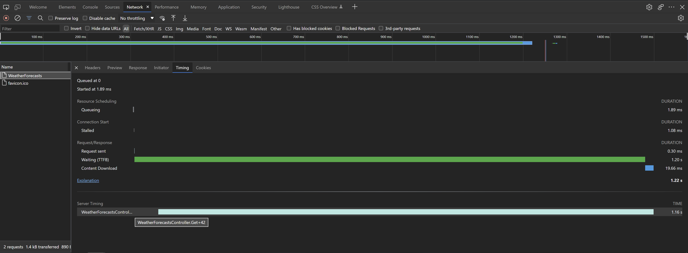
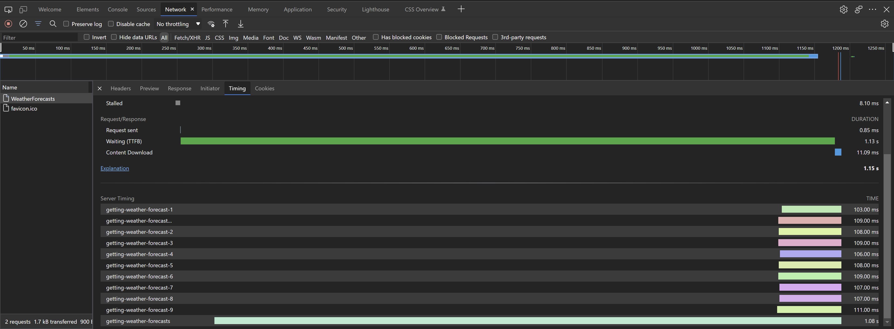

# Advanced

This section covers following subjects:

- [Timing Blocks of Code](#timing-blocks-of-code)
- [Timing Tasks](#timing-tasks)
- [Metric Filters (ASP.NET Core Only)](#metric-filters-aspnet-core-only)

## Timing Blocks of Code

[`ServerTimingExtensions`](../api/Lib.ServerTiming.ServerTimingExtensions.html) provide `TimeAction` method which allows for timing block of code. Calling the method starts a timer which will be stopped upon disposing the returned value.

```cs
...

IDisposable serverTimerInstance = _serverTiming.TimeAction();

for (int daysFromToday = 1; daysFromToday <= 10; daysFromToday++)
{
    weatherForecasts.Add(await GetWeatherForecastAsync(daysFromToday));
};

serverTimerInstance.Dispose();

...
```

This also allows for wrapping code block in `using` statement.

```cs
...

using (_serverTiming.TimeAction())
{
    for (int daysFromToday = 1; daysFromToday <= 10; daysFromToday++)
    {
        weatherForecasts.Add(await GetWeatherForecastAsync(daysFromToday));
    };
}

...
```

Above snippets doesn't provide name for the metric as it is an optional parameter. If not provided, the method will generate a metric name based on caller attributes.

<center></center>

It's possible to nest timed code blocks, in such case it's strongly advised to provide names for metrics.

```cs
...

using (_serverTiming.TimeAction("getting-weather-forecasts"))
{
    for (int daysFromToday = 1; daysFromToday <= 10; daysFromToday++)
    {
        using (_serverTiming.TimeAction($"getting-weather-forecast-{daysFromToday}"))
        {
            weatherForecasts.Add(await GetWeatherForecastAsync(daysFromToday));
        }
    };
}

...
```

Unfortunatelly, the Server Timing API doesn't have a concept of nested metrics and there is no convention for nested rendering in browsers.

<center></center>

## Timing Tasks

[`ServerTimingExtensions`](../api/Lib.ServerTiming.ServerTimingExtensions.html) also provides `TimeTask` method which allows for timing a `Task`.

```cs
...

using (_serverTiming.TimeAction("getting-weather-forecasts"))
{
    for (int daysFromToday = 1; daysFromToday <= 10; daysFromToday++)
    {
        weatherForecasts.Add(await _serverTiming.TimeTask(GetWeatherForecastAsync(daysFromToday), $"getting-weather-forecast-{daysFromToday}"));
    };
}

...
```

The result of the above snippet is exactly the same as the previous one.

## Metric Filters (ASP.NET Core Only)

Filters, available for ASP.NET Core implementation, provide a way to inspect and modify the metrics which are to be delivered in a response to current request. They run on the collected metrics just before they are set as the response header value. This provides flexibility around exposing metrics only in certain scenarios or to certain clients.

Filters can be added when registering the middleware by interacting with the `Filters` collection available on [`ServerTimingOptions`](../api/Lib.AspNetCore.ServerTiming.ServerTimingOptions.html).

```cs
public class Startup
{
    public void Configure(IApplicationBuilder app)
    {
        ...

        app.UseServerTiming(new ServerTimingOptions
        {
            Filters = new List<IServerTimingMetricFilter> { ... }
        });
			
		...
    }
}
```

There is a number of builti-in filters:

* [`RestrictToDevelopmentMetricFilter`](../api/Lib.AspNetCore.ServerTiming.Filters.RestrictToDevelopmentMetricFilter.html) (removes all metrics unless an application is running in development environment)
* [`RestrictDescriptionsToDevelopmentMetricFilter`](../api/Lib.AspNetCore.ServerTiming.Filters.RestrictDescriptionsToDevelopmentMetricFilter.html) (removes the descriptions from all metrics unless an application is running in development environment)
* [`IPRangeMetricFilter`](../api/Lib.AspNetCore.ServerTiming.Filters.IPRangeMetricFilter.html) (removes all metrics unless the current request IP address falls within the specified range)

The [`ServerTimingOptionsExtensions`](../api/Lib.AspNetCore.ServerTiming.ServerTimingOptionsExtensions.html) class provides some helper methods for adding those built-in filters to an instance of [`ServerTimingOptions`](../api/Lib.AspNetCore.ServerTiming.ServerTimingOptions.html).

```cs
public class Startup
{
    public void Configure(IApplicationBuilder app)
    {
        ...
			
        ServerTimingOptions options = new ServerTimingOptions();
        options.RestrictMetricsToDevelopment();

		app.UseServerTiming(options);
			
		...
    }
}
```

Additionally, there is a [`CustomServerTimingMetricFilter`](../api/Lib.AspNetCore.ServerTiming.Filters.CustomServerTimingMetricFilter.html) available (with a dedicated extension method as well) which can take a function to be used for inspecting and modifying the collection of metrics for current request.